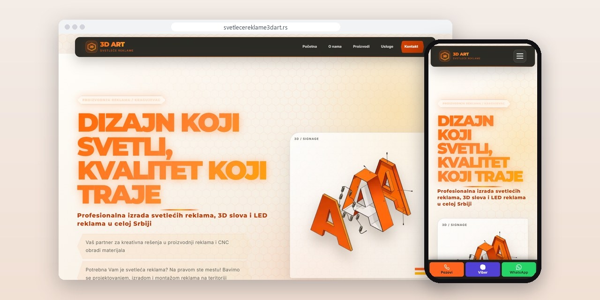
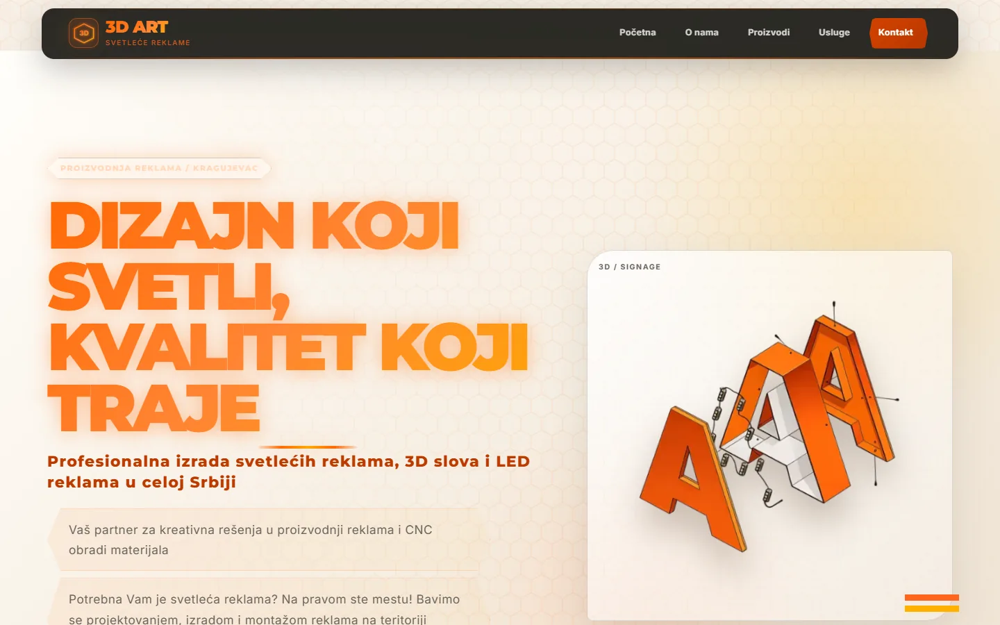
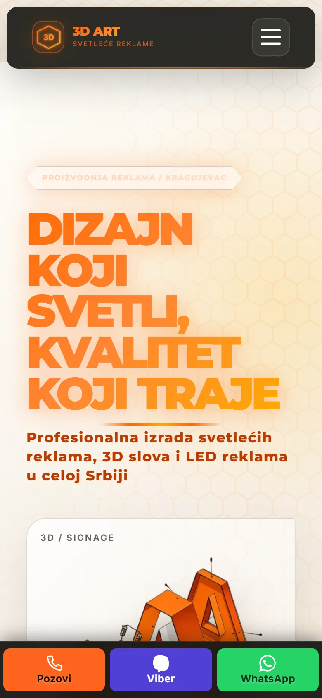
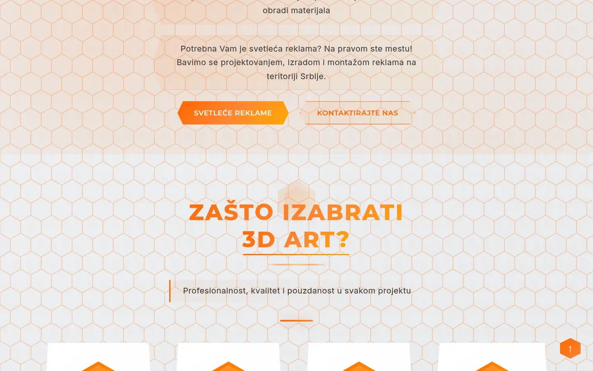
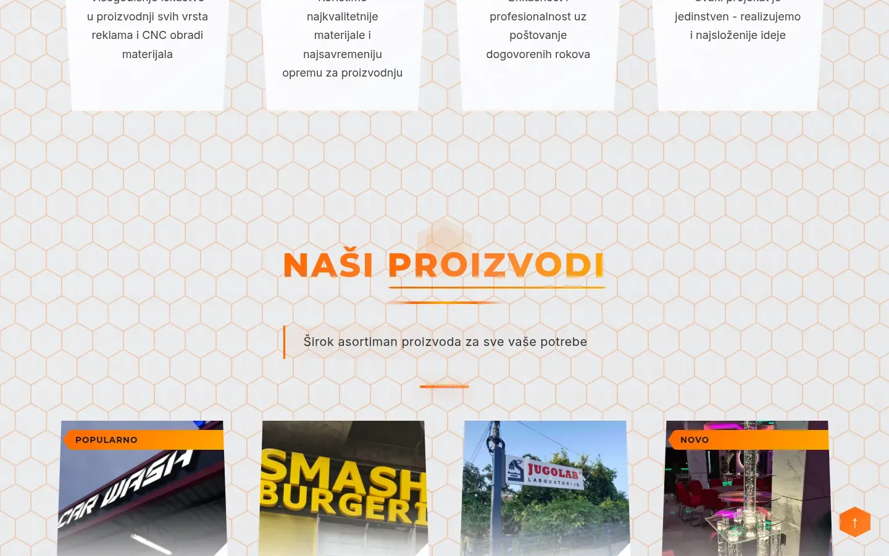

# 3D Art Kragujevac

Sajt od osam strana za radionicu svetlećih reklama iz Kragujevca, sa preko sto fotografija radova i materijalima objašnjenim bez žargona.

**[svetlecereklame3dart.rs](https://svetlecereklame3dart.rs/)** · [Studija slučaja](https://svilenkovic.rs/radovi/3d-art-kragujevac) · [English](README.md)

> [!NOTE]
> Klijentski projekat. Izvorni kod pripada klijentu i čuva se u privatnom repozitorijumu. Ova stranica opisuje šta sam uradio i kako.

<table>
  <tr><td><b>Klijent</b></td><td>3D Art Kragujevac</td></tr>
  <tr><td><b>Delatnost</b></td><td>Svetleće reklame, 3D slova, CNC i laserska obrada</td></tr>
  <tr><td><b>Lokacija</b></td><td>Kragujevac</td></tr>
  <tr><td><b>Vrsta</b></td><td>Sajt sa više strana</td></tr>
  <tr><td><b>Moj deo posla</b></td><td>Dizajn, izrada, SEO, hosting i održavanje</td></tr>
  <tr><td><b>Tehnologije</b></td><td>PHP 8.3, PHPMailer, nginx, FastCGI cache, AVIF/WebP</td></tr>
</table>

## O projektu

3D Art Kragujevac izrađuje i montira svetleće reklame širom Srbije. Na CNC ruteru od 200 x 130 cm i laseru od 130 x 100 cm seče i gravira i za svakog ko donese svoj fajl. Reklama se bira po onome što je firma već uradila, a većina kupaca nikad nije čula za alubond ili stirodur. Sajt je morao da pokaže mnogo izrađenih reklama i da materijale objasni običnim rečima.

Sadržaj sam podelio na osam strana, po jednu za svaku grupu proizvoda plus CNC i lasersku obradu, pa svaka ima svoj naslov i link koji vlasnik može da pošalje kupcu. Već sama strana za svetleće reklame ima osam vrsta, svaka sa kratkim opisom, spiskom osobina i svojom galerijom. Na četiri strane živog sajta našao sam kanonske adrese koje su pokazivale na drugi domen, ostatak šablona od kog je sajt krenuo. Ispravio sam ih, a pre svakog postavljanja na server sada ide provera da se taj domen nigde ne pojavljuje.

## Šta sam uradio

- Galerije sa više od sto fotografija, u prikazu preko celog ekrana koji radi sa strelicama, tasterom Esc i čitačem ekrana
- Forma sa sedam predmeta upita, iza zajedničke zaštite od botova; ako zaštita nije dostupna, forma se zaustavlja i ispisuje broj telefona
- Slike prekodirane u WebP, ukupno sa oko 9,4 na 7,4 MB, a nginx šalje AVIF pregledačima koji ga podržavaju
- Traka za poziv, Viber i WhatsApp na dnu ekrana telefona, kojoj sam menjao boje dok kontrast nije prošao proveru
- Strukturisani podaci za firmu, usluge i česta pitanja, bez ocene od pet zvezdica koja nije imala pokriće
- Adrese stilova i skripte imaju verziju po vremenu izmene fajla, pa i posetilac koji se vraća dobija nov CSS bez brisanja keša

## Merenja

| | Performanse | Pristupačnost | Dobre prakse | SEO |
| :-- | :-: | :-: | :-: | :-: |
| Telefon | 99 | 100 | 100 | 100 |
| Desktop | 98 | 100 | 100 | 100 |

PageSpeed Insights, laboratorijsko merenje živog sajta, septembar 2026. Sigurnosna zaglavlja: 6 od 6. HTML validator: bez grešaka. axe provera pristupačnosti: bez prekršaja. Strukturisani podaci: `FAQPage`, `ItemList`, `LocalBusiness`.

## Snimci ekrana

<table>
  <tr>
    <td width="68%" valign="top"></td>
    <td width="32%" valign="top"></td>
  </tr>
</table>

Dva dugmeta odmah ispod naslova i početak sekcije "Zašto izabrati 3D Art?"

Četiri razloga u jednom redu, pa prelaz na "Naši proizvodi"

---

Izrada: [D. Svilenković](https://svilenkovic.rs).
